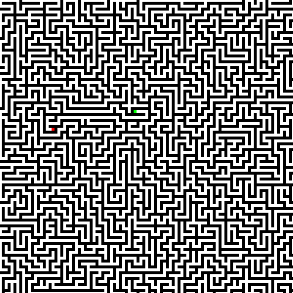

# Maze Generator

This algorithm generates random mazes that will be used to test and compare differents search algorithms (BFS, DFS, A*, BestFirst)

## Installing requirements
`pip3 install -r requirements.txt`

## Running
`python3 maze.py`

## Maze Example

